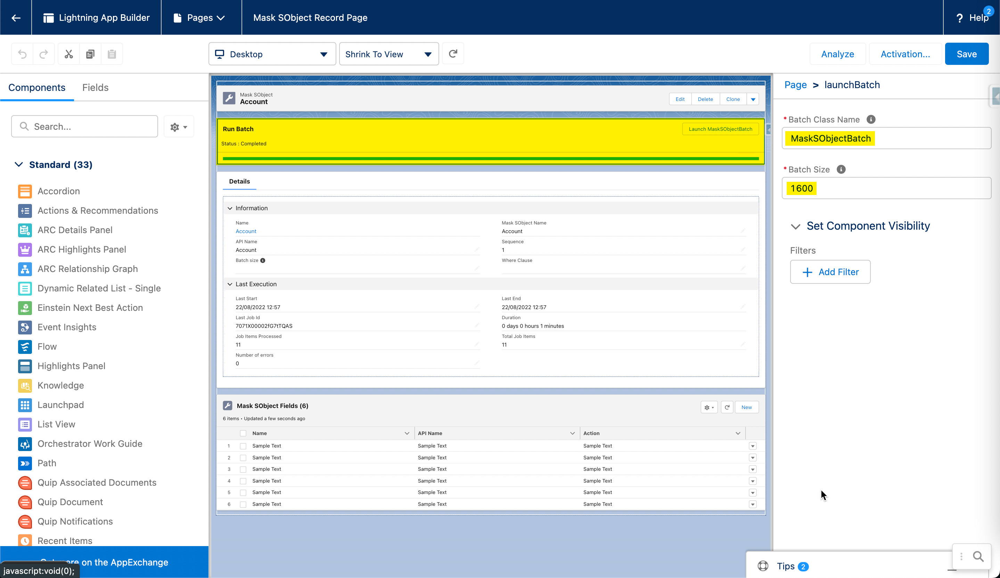
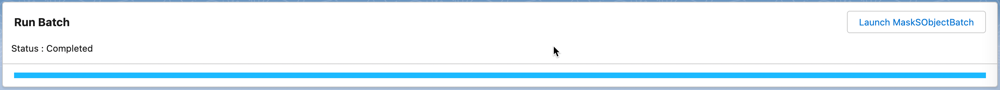
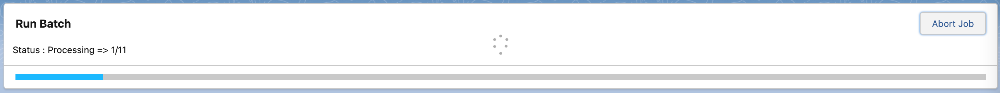

# Launch Batch LWC

This framework allows users to run, abort and monitor Apex batch from a LWC.

# Disclaimer
Launch Batch LWC is not an official Salesforce product, it has not been officially tested or documented by Salesforce.


## How Do You Configure Launch Batch LWC ?

- The configuration is available from Lightning App Builder:

[](./screenshots/configure-lwc.png)

- You can customize labels by editing ./force-app/main/default/labels/CustomLabels.labels-meta.xml or with the UI from Salesforce.

## Various LWC states

- Run
[](./screenshots/run.png)
- Abort
[](./screenshots/running.png)


## Deploy to Salesforce

- Checkout the repo and deploy it with sfdx:
```sh
sfdx force:source:deploy -p force-app
```

- Use GitHub Salesforce Deploy Tool:

[](https://githubsfdeploy.herokuapp.com/?owner=tprouvot&repo=launch-batch-lwc&ref=master)
